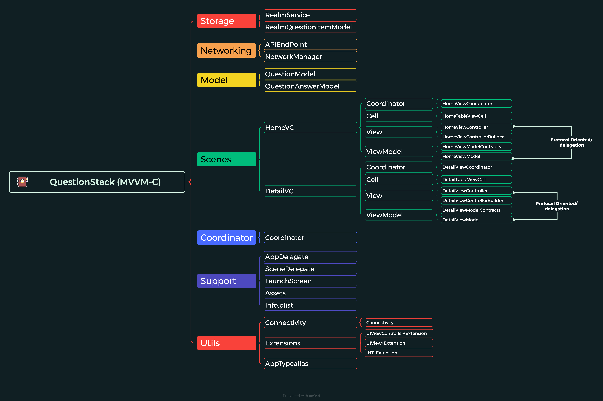

## QuestionStack
"QuestionStack" is a project developed using the MVVM-C architecture and is a product of my personal learning process. I aim to share the knowledge and insights I gained about architecture and related design patterns to help other developers expand their understanding in this field. The MVVM-C structure is significant in our application development practices for creating a clean, modular codebase and enhancing code readability and testability.

## Features:

- **MVVM-C (Model - View - ViewModel - Coordinator)**
- **Programmatic UI**
- **Generic Network Layer**
- **Realm**
- **POP (Protocol Oriented Programming)**
- **Dependency Injection**

  

